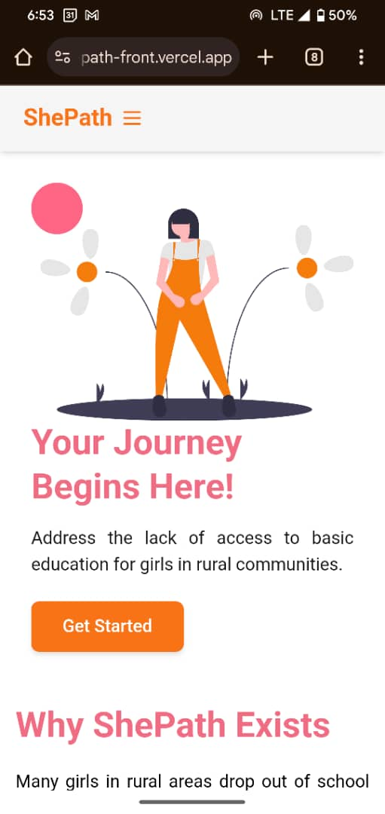

# shePath - Frontend

**shePath** is a web application designed to empower women by providing resources, support, and tools to help them achieve their personal and professional goals. The frontend of the application is built with React and TypeScript, ensuring a modern and dynamic user experience.

## Table of Contents
- [Description](#description)
- [GitHub Repository](#github-repository)
- [Getting Started](#getting-started)
- [Designs](#designs)
- [Deployment Plan](#deployment-plan)
- [Contributing](#contributing)
- [License](#license)

## Description

**shePath** is a platform focused on creating opportunities for women in various fields. It helps them connect, share experiences, and access tools for personal growth and career development. This project serves as the frontend for that platform, providing an intuitive user interface and responsive design.

Developed with React, TypeScript, and TailwindCSS, the frontend ensures scalability and easy maintenance.

## GitHub Repository

Find the my frontend repository here:

[**GitHub - shePath Frontend**](https://github.com/JacquelineTuyisenge/shePath_fe/tree/develop)

## Getting Started

### Prerequisites

Ensure you have the following installed:
- **Node.js** (version 14 or later)
- **npm** (Node package manager)
- **Git** (for cloning the repository)

### Setup

1. **Clone the repository:**

   ```bash
   git clone https://github.com/JacquelineTuyisenge/shePath_fe.git
   ```
2. **Navigate to the project directory:**

   ```bash
   cd shePath_fe
    ```

3. **Install dependencies:**
    ```bash
    npm i
    ```
4. **start server;**
    ```bash
    npm run dev
    ```

### Env Variables
create **.env** file at the root of project and add the environment variables

### Designs

- App Screenshots: 
<br/>
 


### Deployment plan
Vercel for frontend deployment
Link: https://she-path-front.vercel.app/

### Contributor
Jacqueline Tuyisenge

### Licence